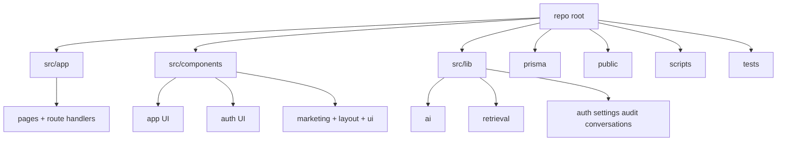
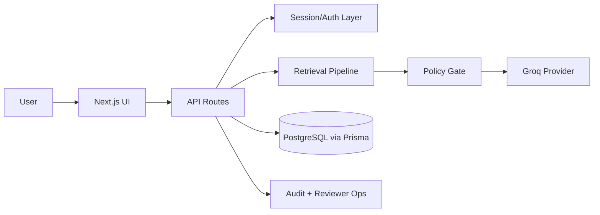
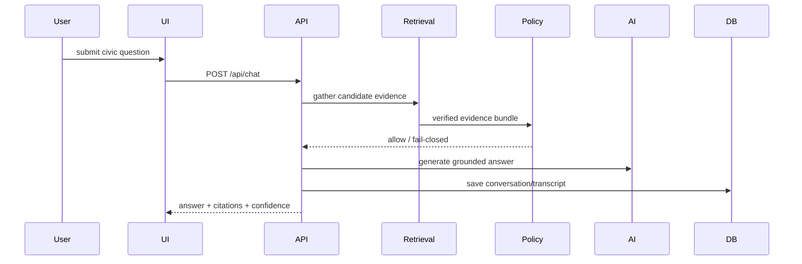
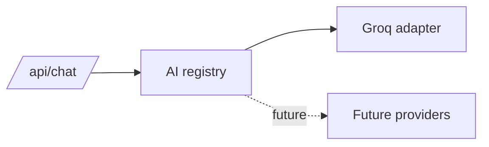
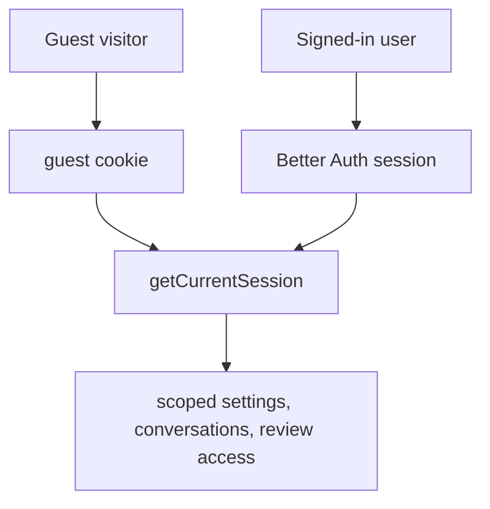
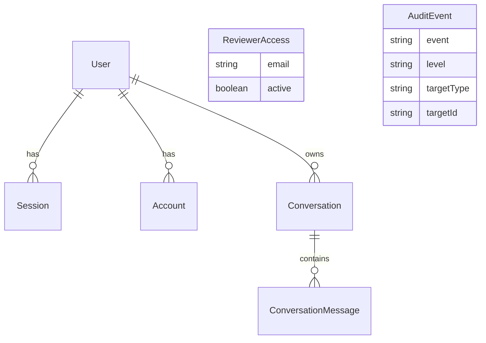
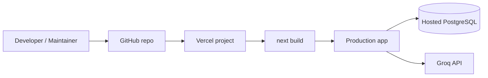
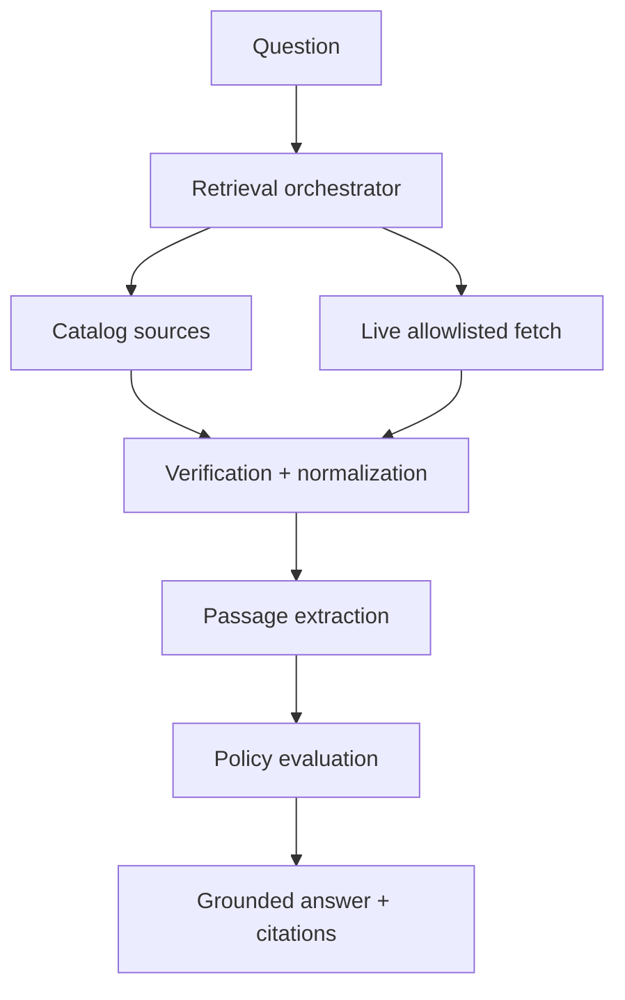

# CivicShield AI

  

<strong>Trusted AI guidance for public services, grounded in official sources.</strong>

  
  
  
  
  
  
  

## Why CivicShield AI exists
CivicShield AI is built to help people navigate public benefits, government services, and urgent support pathways without sacrificing trust. The product is designed so the AI should not invent civic facts, should preserve citations, and should fail closed when evidence cannot be verified safely.

## Screenshots
Place repository screenshots in a future `/docs/screenshots` directory and reference them here for GitHub publication.

## Feature highlights
- Evidence-first civic AI chat
- Verified retrieval and citation traceability
- Guest and authenticated session flows
- Scoped settings persistence and provider-key handling
- Conversation history, continuation, and regenerate foundation
- Transcript quality feedback
- Reviewer queue, workflow notes, and status management
- Persistent audit model, audit viewer, and JSON export
- Reviewer access management with DB-backed foundation

## Tech stack
- Next.js App Router
- React 19
- TypeScript
- Prisma + PostgreSQL
- Better Auth
- Groq
- Zod

## Repository structure

## Overall architecture

## Request lifecycle

## AI provider abstraction

## Authentication flow

## Database relationships

## Deployment pipeline

## Retrieval and citation pipeline

## System requirements
- Node.js 20+
- npm 10+
- PostgreSQL for full persistence and auth/reviewer flows

## Local setup
1. Clone the repository
2. Run `npm install`
3. Copy `.env.local.example` to `.env.local`
4. Generate secrets with `node scripts/generate-local-secrets.mjs`
5. Set a working `DATABASE_URL`
6. Run `npm run prisma:generate`
7. Run `npx prisma migrate dev --name init`
8. Run `npm run dev`

## Environment variables
See:
- `.env.example`
- `.env.local.example`
- `scripts/production-env-checklist.md`
- `LAUNCH_READINESS.md`

## Database setup
- Provision PostgreSQL
- Set `DATABASE_URL`
- Generate Prisma client
- Apply migrations with `prisma migrate deploy` in production

## Commands
- `npm run dev`
- `npm run build`
- `npm run start`
- `npm run lint`
- `npm run typecheck`
- `npm run test`
- `npm run prisma:generate`
- `npm run prisma:migrate:dev`

## Deployment
Start with:
- `DEPLOYMENT.md`
- `LAUNCH_READINESS.md`
- `scripts/vercel-preview-verification-checklist.md`

## Security features
- security headers
- rate limiting on chat
- encrypted provider-key storage
- reviewer-gated governance tooling
- audit event persistence foundation
- evidence-policy fail-closed behavior

## Trust & safety
- official-source grounding only
- low-confidence fallback for insufficient evidence
- no final legal or government decisions by AI

## Open-source project docs
- `ARCHITECTURE.md`
- `ROADMAP.md`
- `CHANGELOG.md`
- `CONTRIBUTING.md`
- `SECURITY.md`
- `SUPPORT.md`
- `AI_USAGE.md`
- `PRIVACY.md`
- `THREAT_MODEL.md`
- `RELEASE_NOTES.md`
- `LAUNCH_READINESS.md`

## License
MIT — see `LICENSE`.

## Credits
Built as a civic AI release-engineering project with a trust-first architecture for public-service guidance.
